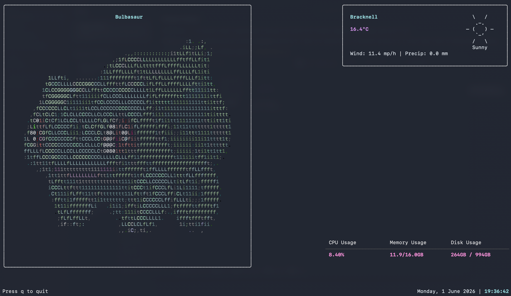

# Terminal Dashboard

A terminal-based dashboard built with Go and Bubble Tea, displaying real-time system information, weather data, time/date and a random Pokemon ASCII art on every run.

## Screenshot



## Prerequisites

- Go 1.20 or later
- macOS/Linux terminal (tested on macOS)

## Dependencies

- [Bubble Tea](https://github.com/charmbracelet/bubbletea) - Terminal UI framework
- [Lipgloss](https://github.com/charmbracelet/lipgloss) - Terminal styling
- [gopsutil](https://github.com/shirou/gopsutil) - System metrics
- [Open-Meteo API](https://open-meteo.com) - Weather data (free, no API key required)
- [PokeAPI](https://pokeapi.co/) - RESTful API for Pokemon details

## Installation

1. Clone the repository:
```bash
git clone https://github.com/JackMaunders/terminal-dashboard
cd terminal-dashboard
```

2. Install dependencies:
```bash
go mod download
```

3. Build the project:
```bash
go build -o dashboard
```

## Usage

Run the dashboard:
```bash
./dashboard
```

### Controls

- **q** or **Ctrl+C**: Quit the application

## Weather Codes

The `weather-codes.json` file maps Open-Meteo weather codes to ASCII art representations and descriptions.

## Future Enhancements

- Ability to reroll Pokemon art
- More details displayed about Pokemon (e.g. evolutions)
- Additional widgets (network, processes, etc.)
- Settings menu

## License

MIT
